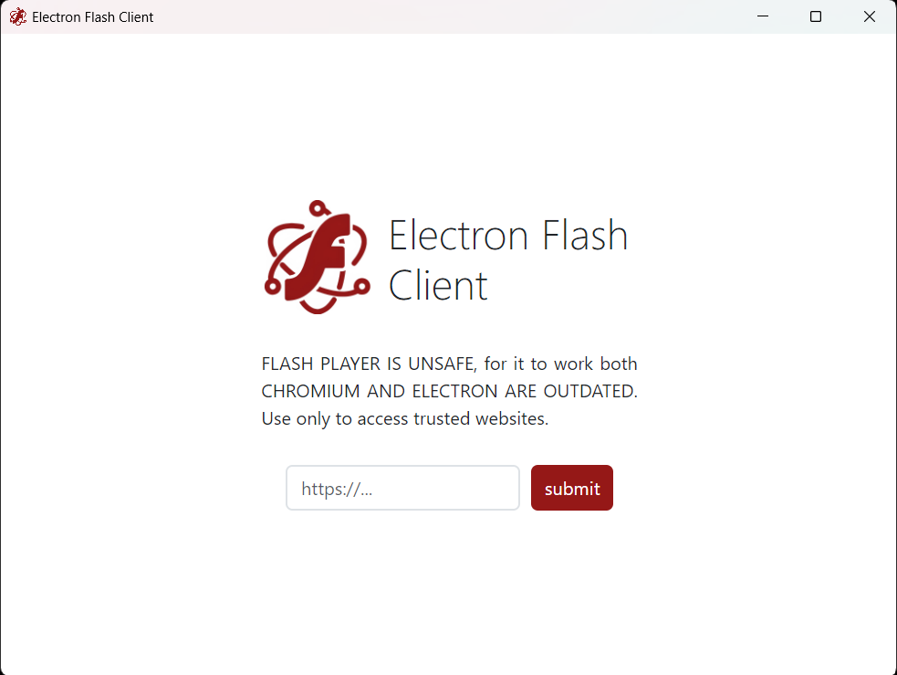

  

# Electron Flash Client

A simplified browser to access websites with Flash Player content

## Installation

Download from the [latest release](../../releases/latest) and run

## Packaging

- Install ***NodeJS***
- Clone the project
- Install dependencies with ``npm i``
- Run with ``npm start``
- Alter ***forge.config.js***
- Package with ``npm run package``
- Make an installer with ``npm run make``

***NOTE***: ***lib/flash*** shoud be unpacked from ***asar***

## Future

- Flash Player memory hacking
- Ad blocking
